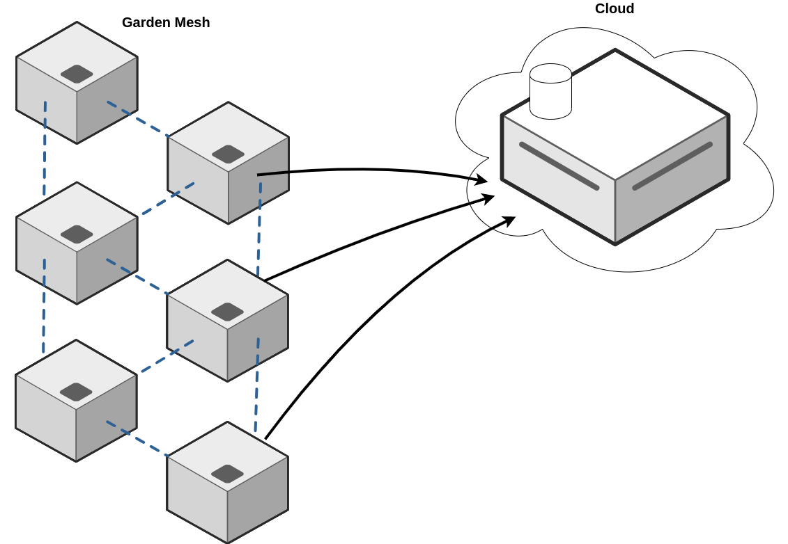
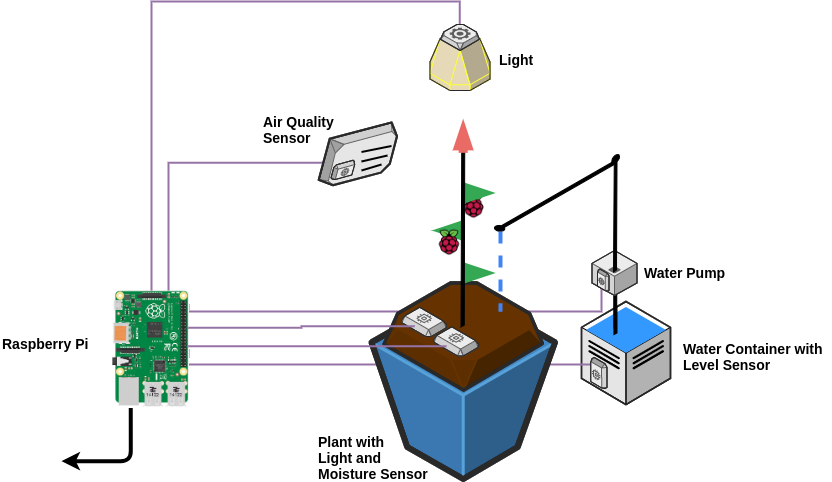
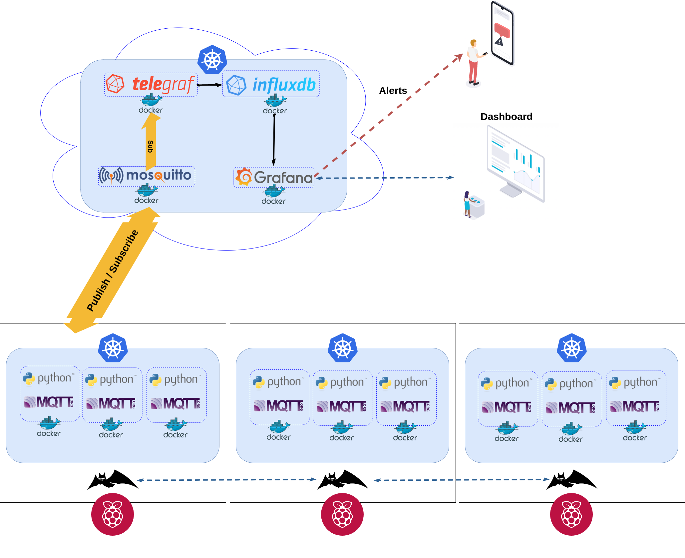
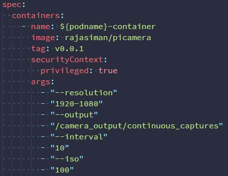

Documentation for Urban Gardening

# Table of Contents

- [Table of Contents](#table-of-contents)
- [Introduction](#introduction)
- [Prerequisites & Components](#prerequisites--components)
    - [Components listed per greenhouse.](#components-listed-per-greenhouse)
  - [Initial Setup](#initial-setup)
- [Installation & Setup](#installation--setup)
  - [Docker Sensor Images](#docker-sensor-images)
  - [Preliminary setup](#preliminary-setup)
  - [Setting up Kubernetes](#setting-up-kubernetes)
    - [Master node setup](#master-node-setup)
    - [worker node setup](#worker-node-setup)
  - [Setting up B.A.T.M.A.N](#setting-up-batman)
    - [Gateway node setup](#gateway-node-setup)
    - [Mesh node setup](#mesh-node-setup)
    - [Testing Kubernetes](#testing-kubernetes)
  - [Setting up the Cloud Environment](#setting-up-the-cloud-environment)
    - [Helm Deployment](#helm-deployment)
    - [Post Deployment Steps](#post-deployment-steps)
      - [Connecting Grafana with Influxdb](#connecting-grafana-with-influxdb)
      - [Grafana Charts](#grafana-charts)
      - [Grafana Alerts](#grafana-alerts)
        - [Create a Telegram Altert](#create-a-telegram-altert)
  - [Setting up the Greenhouse Environment](#setting-up-the-greenhouse-environment)
    - [Connecting Sensors](#connecting-sensors)
    - [Camera Configuration Options](#camera-configuration-options)
    - [Start Sensor and Actuators](#start-sensor-and-actuators)

# Introduction
This project provides an infrastructure to implement a self sustaining smart garden. It uses state-of-the-art technologies to implement a variety of useful tools to monitor, alert and explore on the basis of the data.
The core of our work is the implementation of a greenhouse which provides sensors and actuators controlled via cloud systems to provide an optimal environment for plants.

In picture 1 we can see in the general overview the idea to connect multiple greenhouses via a wifi network mesh to a Cloud service. Whereby particular greenhouses can serves as a gateway and are directly connected to the cloud.


The greenhouses themselves contain a variety of sensors and actuators, as shown in Figure 2. These sensors and actuators are connected via the GPIO connectors to an Raspberry pi.  The Raspberry pi gathers the sensor data and distributes this data via the above mentioned mesh network. The Pi also receives instructions for the connected actuators and executes them.


Figure 3 gives an overview about the Software implementation. In the lower part we see Multiple Pi's which implement the mesh network via [B.A.T.M.A.N](https://www.open-mesh.org/projects/open-mesh/wiki). B.A.T.M.A.N. (better approach to mobile ad-hoc networking) is a routing protocol for multi-hop ad-hoc mesh networks. The sensor & actuator logic is implemented via Python and containerized in [Docker](https://www.docker.com/). Each Raspberry is a Worker Node in a [K3s](https://k3s.io/) cluster.  K3s is a lightweight Kubernetes built for IoT & Edge computing. It perfect to for running on something as small as a Raspberry Pi.  
The sensor communication is realized via [MQTT](http://mqtt.org/). In particular we use [Paho mqtt](https://www.eclipse.org/paho/) for pyhton on the Pi side and a Mosquitto MQTT Broker on the cloud side. 

The cloud environment  consists of four services. A [Mosquitto](https://mosquitto.org/man/mqtt-7.html) MQTT broker for the communication with the greenhouse instances. [Telegraf](https://www.influxdata.com/time-series-platform/telegraf/) which subscribes to the published topics by the greenhouse sensors and  saves the data in an [influxdb](https://www.influxdata.com/) database. And lastly [Grafana](https://grafana.com/) which is used for data visualization and alerting.   

# Prerequisites & Components
For the creation of the project we used a desktop computer as cloud environment(Master node) and raspberry pi's as worker nodes

### Components listed per greenhouse.

| Component                 | Description                                                  |
| ------------------------- | ------------------------------------------------------------ |
| Raspberry Pi 3B / 4       | -                                                            |
| MicroSD Card 32GB         | -                                                            |
| DHT22 Sensor              | Temperature & Humidity Sensor                                |
| Water Level Sensor        | Analog Water Level Sensor                                    |
| Soil Moisture Sensor      | Analog Soil Moisture Sensor                                  |
| LDR                       | Light Dependent Resistor                                     |
| MCP3008                   | 8 Channel 10-bit ADC                                         |
| Breadboard                | 1 Piece                                                      |
| Male to Male Connectors   | 100 Pieces                                                   |
| Male to Female Connectors | 100 Pieces                                                   |
| 5v Power Supply           | Power supply for Raspberry Pi. 2.5A Power Supply recommended |
| 5v Waterpump              | Water pump (Not implemented)                                 |
| RGB LED                   | NeoPixel Ring - 12 x RGB LED                                 |
| Jumper-Cabel              | 5v power supply for LED                                      |

## Initial Setup

- [Downloading Raspbian](https://www.raspberrypi.org/downloads/raspbian/)
- Writing the Raspbian Image to the SD Card
  - [Windows](https://www.raspberrypi.org/documentation/installation/installing-images/windows.md)
  - [Linux](https://www.raspberrypi.org/documentation/installation/installing-images/linux.md)
  - [MacOS](https://www.raspberrypi.org/documentation/installation/installing-images/mac.md)
  - [ChromeOS](https://www.raspberrypi.org/documentation/installation/installing-images/chromeos.md)

# Installation & Setup
This chapter describes the whole installation from the build of the docker and Rasbian images with Kubernetes & B.A.T.M.A.N.
 As well as the hardware Sensor depolyment and the Software Cloud & Sensor deployment.
## Docker Sensor Images
Each sensor has its own docker Image. We use [balenalib raspbian] (https://hub.docker.com/r/balenalib/rpi-raspbian) Images which is optimized for use in IoT Devices. Use the -f option in the scripts directory to make sure Docker finds all the files it needs.
Example to build the dht sensor:

       .../gardening-adventure/scripts$ docker build -f dht_sensor/Dockerfile -t dht .

## Preliminary setup

Start the RPi for the first time  
login with default username and password  
raspi-config

- change password
- add information for wireless access
- enable ssh
- update lists & upgrade packages
- restart system
- note down IP address
- disconnect monitor and ethernet, verify connectivity on Wireless and ssh access

## Setting up Kubernetes


### Master node setup
### worker node setup

## Setting up B.A.T.M.A.N

A mesh network is created using B.A.T.M.A.N Adv. The resultant topology contains general nodes along with some nodes acting as gateways to connect to the server . The gateways nodes are connected to internet via ethernet and nodes are connected among each other on wlan using B.A.T.M.A.N Adv. The configuration for B.A.T.M.A.N Adv in your Pi are established through containers, by build corressponding images from the dockerfile listed under `batman` folder.

When you add a new node, make sure to modify the ip address listed in `bat0` file accordingly.

### Gateway node setup

Run the following commands from the directory that contains the dockerfile to build gateway image.

```bash
  docker build -t gateway-img .
```

Now, Run the container from the image

```bash
  docker run --network=host --privileged -d -it gateway-img /bin/bash gardening-adventure/batman/gateway/garden-mesh.sh
```

### Mesh node setup

Run the following commands from the directory that contains the dockerfile to build node image.

```bash
  docker build -t node-img .
```

Now, Run the container from the image

```bash
  docker run --network=host --privileged -d -it node-img /bin/bash gardening-adventure/batman/node/garden-mesh.sh
```

### Testing Kubernetes
## Setting up the Cloud Environment
This chapter describes the implementation of the Cloud services. In detail the installation of Grafana, Influxdb, Mosquitto MQTT Broker and Telegraf.

We use for all the cloud service installations [Helm](https://helm.sh) scripts. For the installation of Helm, please refer to the [documentation](https://helm.sh/docs/intro/quickstart/).
### Helm Deployment
First add the Mosquitto Broker helom chart via: ` helm repo add smizy https://smizy.github.io/charts`
To start the services you can run the script in `gardening-adventure/cloud_garden/deployment/cloud_deployment.sh` This will start [Grafana](https://github.com/helm/charts/tree/master/stable/grafana), [Influxdb](https://github.com/helm/charts/tree/master/stable/influxdb), [Mosquitto MQTT Broker](https://github.com/smizy/charts/tree/master/mosquitto) and [Telegraf](https://github.com/helm/charts/tree/master/stable/telegraf) via helm. 
**Notice**: This will start the services without any node selection. For that edit the corresponding settings in the yaml files.  For adding a label to a node use the following command : `kubectl label nodes <nodename> <key>=<value> --overwrite`
### Post Deployment Steps
#### Connecting Grafana with Influxdb
Login to the grafana UI.  The IP is shown at the deployment or run: 
To connect grafana with influxDB 

THIS SECTION IS INCOMPLETE

#### Grafana Charts
After the datasource has been added the next step is to add the dashboard which displays the data from the datasource.
* To create a Grafana dashboard click on `New dashboard`(Create -> New Dashboard -> Graph). 
* Click on Panel Title -> Edit. A new window with the graph will open up. Here we select the metric we would want to display in the graph. I will use the Temperature as an example.
* Pick the data source that was defined earlier in the data source field. Tip: This should be influxdb datasource.
* edit the query as follows -> in the `FROM` line, select the sensor name in the second dropdown. This will be the sensor that the graph will depict values from. In the `SELECT` line, pick the appropriate field, for example `temperature`. Pick the desired grouping time interval on line 3 and save the graph by clicking the save icon on the top right hand side.
* Check the visibility of the data on the dashboard, the data should be available as a graph.


#### Grafana Alerts
We used [Grafana's Alerts](https://grafana.com/docs/grafana/latest/alerting/rules/) to receive [notifications](https://grafana.com/docs/grafana/latest/alerting/notifications/) when, for example, humidity drops below a certain level.
As an example we show here to configure an Alert sent to telegram. For more options please have a look at the Grafana's Alert documentation.
##### Create a Telegram Altert
1. Created a bot via @BotFather, and get an API token in telegram
2. Create new Chat Group in Telegram App, for example: “Super Dooper Alert Group” with people who need to be alerted.
3. Invite your bot to this group
4. Type at least one message in that group,  **this is very important**
5. Use cURL or just place this on any Browsers Address Bar: `https://api.telegram.org/bot<TOKEN>/getUpdates`
This should return an JSON object, you need to find key “chat” like this one:  
`"chat":{"id":-456343576,"title":"Super Dooper Alert Group","type":"group","all_members_are_administrators":true}`
6. Login to grafana
7. Click to the left Bell icon
8.  Add notification channel
9. Select Telegram
10. Enable/disable settings you preger
11. Put Telegram API token to he fiel
12. Add chat ID (it starts with -, and that needs too)
13. Click Test notification
14. Save it.
15. Create a Rule in the moister Graph panel 
16. Go to dashboard 
17. Select the desired Graph
18. Click Alarm icon
19. Click "Create Alert"
## Setting up the Greenhouse Environment

This chapter describes the installation of a new smart greenhouse.
The installation includes the hardware and the software configuration of the sensors/actuators and the Pi. 
### Connecting Sensors
Figure 4 shows the wiring of the sensors with the Raspberry Pi. Please note that an external 5V power supply is required when using several sensors and actuators. This is especially true if you use an LED light or a water pump.


### Camera Configuration Options
The Raspberry Pi Camera module supports a variety of resolutions, ISO settings, Interval between Capture of Photos. All of these parameters are configurable. The camera_module.yml file takes all these parameters and deploys the camera module with the parameters requested. In the `spec` section, under `container` section, the options for the camera can be set under `arguments` section.

If no options under this section is set in the camera_module.yml file, the camera module is deployed with the default values. The default values and the supported values are described in the table below.

| Argument   | Description                         | Supported Values                                             | Default Value                       |
| ---------- | ----------------------------------- | ------------------------------------------------------------ | ----------------------------------- |
| resolution | Image resolution                    | 1920-1080, 3280-2464, 1640-1232, 1640-922, 1280-720, 640-480 | 1920-1080                           |
| output     | Location to store output.           | Any valid *nix path                                          | /camera_output/continuous_captures/ |
| interval   | Number of seconds between captures. | Must be an Integer.                                          | 10                                  |
| iso        | ISO Sensitivity Settings            | 100 - 800                                                    | 100                                 |




### Start Sensor and Actuators
If all required sensors are wired you can continue with the software installation. The installation of the desired devices is happening via a shell script. For that it is required that K3s is running on the Pi controlling the sensors and the IP address for the MQTT Broker is known.
To start the Sensors run the  ```gardening-adventure/scripts/sensor_deployment.sh``` script in an environment with [kubectl](https://kubernetes.io/docs/tasks/tools/install-kubectl/#verifying-kubectl-configuration) configured. After the deployment the sensors immediately start sending data to the MQTT Broker
